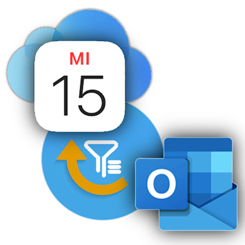

<!-- SHIELDS -->

[![Stargazers][stars-shield]][stars-url]
[![Issues][issues-shield]][issues-url]

<!-- PROJECT LOGO -->
 

  

  <h1 align="center">Outlook Calendar Sync</h1>

  

    Think different. Sync different.  
    Synchronize a selection of your Outlook work appointments to your personal calendar.
     
    <a href="https://github.com/thgossler/OutlookCalendarSync-pub/issues">Report Bug</a>
    ·
    <a href="https://github.com/thgossler/OutlookCalendarSync-pub/issues">Request Feature</a>
    ·
    <a href="https://www.apps.thomas-gossler.de/OutlookCalendarSync/?utm_source=GitHub">Homepage</a>
    ·
    <a href="https://thomasgossler.blob.core.windows.net/outlookcalendarsync/OutlookCalendarSync-Setup.exe">Download</a>
  

## Overview

This Windows desktop program synchronizes your (work) appointments from your Microsoft Outlook Desktop (classic) calendar 
selectively and one-way to a (personal) target calendar (iCloud/Google) with data protection and privacy in mind.

I created this program a long time ago and it's been doing a great job for me personally. Recently, I decided to make
it available for others as well. I have polished it for being usable by a wider audience. I hope you find it useful, too. 

And here's the typical use scenario for the tool (see also the [homepage](https://www.apps.thomas-gossler.de/OutlookCalendarSync/?utm_source=GitHub) 
for a more detailed presentation):

As a busy professional managing both work and personal commitments, keeping track of your work schedule outside the
office can be challenging. You might prefer using your personal iPhone over a company phone for convenience, or perhaps
you don't have a work phone at all. However, company policies often restrict the use of personal devices for work
purposes, making it difficult to stay updated with your work calendar.

Introducing Outlook Calendar Sync - the perfect solution for employees who use Microsoft Outlook but can't sync their
work calendars to their personal smartphone due to company restrictions. With Outlook Calendar Sync, you can seamlessly
transfer your Outlook appointments to your personal calendar via the Outlook Desktop application.

As a long-time employee of large companies with many regulations myself, I understand the importance of maintaining both
your privacy and adherence to company policies. My tool optionally only syncs the titles and locations of your work appointments,
ensuring your data remains secure. Now, you can effortlessly manage your work-life balance by staying up-to-date with your
work schedule on your personal device without compromising privacy or violating company rules.

Stay on top of your appointments, whether you're at home or on the go, and easily hide your work calendar as separate
calendar when you need personal time. Outlook Calendar Sync helps you keep your professional and personal lives
in perfect harmony :smile:

Let me know whether this fits your needs or if you have any suggestions for improvements.

_**Note:** My plan is to open source it completely once I have sold 50k licenses. So, if you should be interested to get access
to the source code and contribute or create your own version of it, then help me promote it._

## Features

- Synchronizes Outlook calendar events to a target calendar (one-way, filtered)
- Supports iCloud and Google as target calendars, more to come
- Default configuration settings are privacy by default and design (see data privacy policy)
- Syncs reliably into an existing target calendar (empty or not) without affecting existing entries
- Flexible configuration via SyncSettings.json (auto-reload) and/or config UI
- Selectively ignores events based on blacklists of regular expressions
- Configure regular expression transformation patterns for event titles in config file
- Supports command line arguments for automation (start with /? for more information)
- Support automatic start via Windows task scheduler (or startup folder as fallback)
- Should work on all supported Windows 10+ versions (tested on 64 bit Intel/ARM, classic Outlook Desktop 2019+ with COM interface)
- Allows to reviewing the log stream when the console window is shown

## Data Privacy

Because I do not collect any data from the program, I am unable to see if you experience any issues 
while using it. I kindly ask that you appreciate this commitment to high privacy standards at a low, 
fixed price (with no recurring subscription fees). Instead of posting complaints publicly, please 
provide your feedback directly by submitting an issue on the page linked above. If you're unable to do 
so, feel free to contact me via email (details available on the website).

## Usage tips

Many users might not be familiar with regular expressions, so here is a brief introduction:

In the settings fields where regular expressions are supported, you can easily exclude an event by using specific patterns. Here is an example to illustrate:

**Example:**

Suppose you want to ensure that events (i.e. Outlook appointments) with subjects (i.e. titles) containing the word "Lunch" are not getting synchronized. You would add the following line to the appropriate settings field:

`Lunch`

This pattern will match any title containing "Lunch" and exclude it from syncing. 

If subjects shall only match when starting with "Lunch", you can use:

`^Lunch`

The `^` symbol indicates that the word "Lunch" must be at the beginning of the title to match.

"Lunch" at the end of a title would match with `Lunch$`.

An exact subject of "Lunch" would match with `^Lunch$`.

Please note that these patterns are case-sensitive. To match both "Lunch" and "lunch," you have to use one the following ways to match in a case-insensitive manner:

`^(L|l)unch`

**Important Aspects of .NET Regular Expressions**

- **Case Sensitivity:** By default, .NET regular expressions are case-sensitive. To perform a case-insensitive match, you can use the `(?i)` option. For example, `(?i)Lunch` will match "Lunch," "lunch," "LUNCH," etc.

- **Special Characters:** Certain characters have special meanings in regular expressions (e.g., `.`, `*`, `?`, `+`). To match these characters literally, you need to escape them with a backslash (`\`). For example, to match a period, use `\.`.

For a deeper understanding of .NET regular expressions, you can refer to a comprehensive [quick reference guide](https://download.microsoft.com/download/D/2/4/D240EBF6-A9BA-4E4F-A63F-AEB6DA0B921C/Regular%20expressions%20quick%20reference.pdf) or search online for resources using terms like "Learn .NET regular expressions."

This [online tool](https://regex101.com/r/mziATF/1) will help you to write and test .NET regular expressions.

By familiarizing yourself with these basics and critical aspects, you can effectively use regular expressions to manage your appointments and other tasks.

## Download

You can find the latest version of the program on the 
<a href="https://www.apps.thomas-gossler.de/OutlookCalendarSync/?utm_source=GitHub" target="_blank">Homepage</a> 
or directly download it from 
[here](https://thomasgossler.blob.core.windows.net/outlookcalendarsync/OutlookCalendarSync-Setup.exe).

## Roadmap

- [ ] Support more target calendar types (e.g. Outlook.com/Exchange)
- [ ] Support the new Outlook app (the classic Outlook is supported by Microsoft at least until 2026)
- [ ] Option to exclude appointments with certain Outlook categories or private flag
- [ ] Support multiple sync target configurations in parallel (e.g. iCloud & Google calendar)
- [ ] Option to sync appointments to different sync targets depending on
  their Outlook category
- [ ] Configure a specific time period (start/end date) for sync instead of a
  floating time window (+/- 7 days)
- [ ] Introduce support for UI dark mode with update to .NET 10 LTS
- [ ] Use the Windows Copilot Runtime to remove personal information from event
  titles before sync
- [ ] Further improvements based on your feedback :-)

## Technology

- .NET 9 / C#
- WinForms
- iCloud.Dav.Calendar (.NET library for iCloud calendar access)
- Microsoft Azure Cloud (for hosting the backend service for licence handling)
- Paddle (for global payment processing)
- WebView2 (for enabling in-app purchase)

<!-- MARKDOWN LINKS & IMAGES (https://www.markdownguide.org/basic-syntax/#reference-style-links) -->
[contributors-shield]: https://img.shields.io/github/contributors/thgossler/OutlookCalendarSync-pub.svg
[contributors-url]: https://github.com/thgossler/OutlookCalendarSync-pub/graphs/contributors
[forks-shield]: https://img.shields.io/github/forks/thgossler/OutlookCalendarSync-pub.svg
[forks-url]: https://github.com/thgossler/OutlookCalendarSync-pub/network/members
[stars-shield]: https://img.shields.io/github/stars/thgossler/OutlookCalendarSync-pub.svg
[stars-url]: https://github.com/thgossler/OutlookCalendarSync-pub/stargazers
[issues-shield]: https://img.shields.io/github/issues/thgossler/OutlookCalendarSync-pub.svg
[issues-url]: https://github.com/thgossler/OutlookCalendarSync-pub/issues
